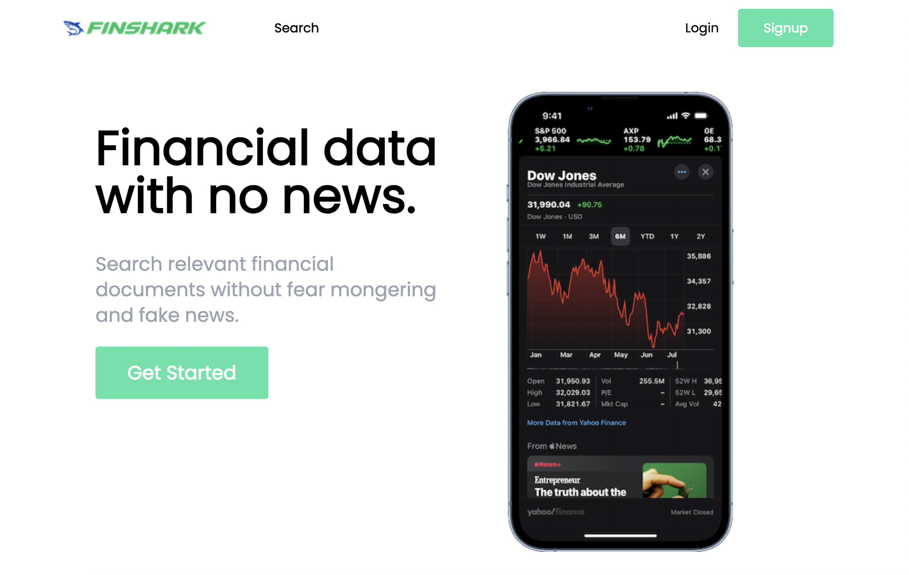

# 🦈 FinShark — Stock Market Research Platform

> A full-stack financial research web application for searching, analyzing, and tracking publicly listed companies. Built with ASP.NET Core 8 Web API and React TypeScript, featuring real-time stock data, financial statements, and a personal portfolio manager.


---

## 📸 Preview



---

## 📋 Table of Contents

- [Overview](#-overview)
- [Features](#-features)
- [Tech Stack](#-tech-stack)
- [Architecture](#-architecture)
- [Getting Started](#-getting-started)
- [API Endpoints](#-api-endpoints)
- [Project Structure](#-project-structure)
- [Environment Variables](#-environment-variables)
- [Contributing](#-contributing)

---

## 🔍 Overview

FinShark is a full-stack investment research platform that pulls live financial data from the **Financial Modeling Prep (FMP) API** and presents it in a clean, intuitive interface. Users can register, search for any NASDAQ-listed company, view detailed financials, and build a personal watchlist portfolio — all protected behind JWT authentication.

This project demonstrates end-to-end software development: RESTful API design, repository pattern, EF Core with SQL Server, JWT + ASP.NET Identity, and a modern React TypeScript frontend with protected routing and context-based auth.

---

## ✨ Features

- 🔐 **Authentication & Authorization** — Register/Login with JWT Bearer tokens and ASP.NET Core Identity; role-based access control
- 🔎 **Company Search** — Search any NASDAQ company by ticker or name using the FMP API
- 🏢 **Company Dashboard** — Dedicated page per company with sidebar navigation across multiple financial views
- 📊 **Financial Statements** — View Income Statement, Balance Sheet, and Cash Flow Statement with historical data
- 📈 **Key Metrics & Ratios** — TTM (trailing twelve months) financial ratios and KPIs
- 💹 **Historical Dividends** — Dividend history rendered as a line chart via Recharts
- 🔗 **Comparable Companies (Comps)** — Quickly find peers for any ticker
- 📄 **10-K Filings Finder** — Direct links to annual SEC filings
- 💼 **Portfolio Manager** — Add/remove stocks to a personal portfolio stored in the database
- 💬 **Stock Comments** — Community comment threads per stock
- 🌐 **Swagger UI** — Full API documentation available in development mode

---

## 🛠 Tech Stack

### Backend — `api/`

| Technology | Purpose |
|---|---|
| **ASP.NET Core 8** | Web API framework |
| **Entity Framework Core 8** | ORM for database access |
| **SQL Server** | Relational database |
| **ASP.NET Core Identity** | User management & role-based auth |
| **JWT Bearer Authentication** | Stateless API security |
| **Newtonsoft.Json** | JSON serialization |
| **Swagger / Swashbuckle** | API documentation & testing UI |
| **Repository Pattern** | Abstracts data access layer |
| **Financial Modeling Prep API** | Live stock & financial data source |

### Frontend — `frontend/`

| Technology | Purpose |
|---|---|
| **React 18** | UI component library |
| **TypeScript** | Static typing for reliability |
| **Tailwind CSS 3** | Utility-first styling |
| **React Router DOM 6** | Client-side routing & protected routes |
| **Axios** | HTTP client for API calls |
| **React Hook Form + Yup** | Form management and validation |
| **Recharts** | Financial data charts |
| **React Toastify** | User notifications |
| **React Spinners** | Loading state indicators |
| **React Icons** | UI iconography |
| **Context API** | Global auth state management |

---

## 🏛 Architecture

```
FinShark/
├── api/                          # ASP.NET Core 8 Web API
│   ├── Controllers/              # HTTP endpoints (Account, Stock, Comment, Portfolio)
│   ├── Models/                   # EF Core entity classes
│   ├── Dtos/                     # Data Transfer Objects (request/response shapes)
│   ├── Interfaces/               # Repository & service contracts
│   ├── Repository/               # EF Core data access implementations
│   ├── Service/                  # Business logic (JWT token, FMP integration)
│   ├── Mappers/                  # Entity ↔ DTO mapping
│   ├── Helpers/                  # Query objects for filtering/sorting/paging
│   ├── Data/                     # ApplicationDBContext
│   ├── Migrations/               # EF Core database migrations
│   └── Program.cs                # Service registration & middleware pipeline
│
└── frontend/                     # React 18 TypeScript SPA
    └── src/
        ├── Components/           # Reusable UI components
        ├── Pages/                # Route-level page components
        ├── Services/             # API service functions
        ├── Context/              # Auth context (useAuth hook)
        ├── Models/               # TypeScript type definitions
        ├── Helpers/              # Utility functions
        ├── Routes/               # Protected route wrapper
        └── api.tsx               # FMP API integration layer
```

**Design Patterns used:** Repository Pattern, Dependency Injection, DTO Pattern, Service Layer, Context API (frontend).

---

## 🚀 Getting Started

### Prerequisites

- [.NET 8 SDK](https://dotnet.microsoft.com/download/dotnet/8)
- [Node.js 18+](https://nodejs.org/)
- [SQL Server](https://www.microsoft.com/en-us/sql-server/sql-server-downloads) (Express edition works fine)
- A free [Financial Modeling Prep API key](https://financialmodelingprep.com/developer/docs/)

---

### 1. Clone the repository

```bash
git clone https://github.com/YOUR_USERNAME/FinShark.git
cd FinShark
```

### 2. Configure the backend

Edit `api/appsettings.json`:

```json
{
  "ConnectionStrings": {
    "DefaultConnection": "Server=YOUR_SERVER;Database=finshark;Trusted_Connection=True;"
  },
  "FMPKey": "YOUR_FMP_API_KEY",
  "JWT": {
    "Issuer": "http://localhost:5246",
    "Audience": "http://localhost:5246",
    "SigningKey": "YOUR_STRONG_SIGNING_KEY_MIN_32_CHARS"
  }
}
```

### 3. Run database migrations

```bash
cd api
dotnet ef database update
```

### 4. Start the backend

```bash
dotnet run
# API runs on https://localhost:5246
# Swagger UI: https://localhost:5246/swagger
```

### 5. Configure the frontend

Create `frontend/.env`:

```env
REACT_APP_API_KEY=YOUR_FMP_API_KEY
```

### 6. Start the frontend

```bash
cd frontend
npm install
npm start
# App runs on http://localhost:3000
```

---

## 📡 API Endpoints

| Method | Endpoint | Auth Required | Description |
|---|---|---|---|
| `POST` | `/api/account/register` | ❌ | Register a new user |
| `POST` | `/api/account/login` | ❌ | Login and receive JWT |
| `GET` | `/api/stock` | ✅ | Get all stocks (with filtering) |
| `GET` | `/api/stock/{id}` | ❌ | Get stock by ID |
| `POST` | `/api/stock` | ❌ | Create a stock record |
| `PUT` | `/api/stock/{id}` | ❌ | Update a stock |
| `DELETE` | `/api/stock/{id}` | ❌ | Delete a stock |
| `GET` | `/api/comment` | ❌ | Get all comments |
| `POST` | `/api/comment/{stockId}` | ✅ | Add comment to a stock |
| `PUT` | `/api/comment/{id}` | ✅ | Update a comment |
| `DELETE` | `/api/comment/{id}` | ✅ | Delete a comment |
| `GET` | `/api/portfolio` | ✅ | Get user's portfolio |
| `POST` | `/api/portfolio` | ✅ | Add stock to portfolio |
| `DELETE` | `/api/portfolio` | ✅ | Remove stock from portfolio |

Full interactive docs available at `/swagger` when running in development mode.

---

## 🔑 Environment Variables

### Backend — `appsettings.json`

| Key | Description |
|---|---|
| `ConnectionStrings:DefaultConnection` | SQL Server connection string |
| `FMPKey` | Financial Modeling Prep API key |
| `JWT:Issuer` | JWT token issuer URL |
| `JWT:Audience` | JWT token audience URL |
| `JWT:SigningKey` | Secret key for signing JWT tokens (min. 32 chars) |

### Frontend — `.env`

| Key | Description |
|---|---|
| `REACT_APP_API_KEY` | Financial Modeling Prep API key |

> ⚠️ **Never commit** `appsettings.json` with real secrets or `.env` files to version control. Add them to `.gitignore`.

---

## 🤝 Contributing

Pull requests are welcome. For major changes, please open an issue first to discuss what you'd like to change.

1. Fork the repository
2. Create your feature branch: `git checkout -b feature/AmazingFeature`
3. Commit your changes: `git commit -m 'Add some AmazingFeature'`
4. Push to the branch: `git push origin feature/AmazingFeature`
5. Open a Pull Request

---

## 📄 License

This project is open source and available under the [MIT License](LICENSE).

---

<div align="center">
  Built with ❤️ using .NET 8 & React TypeScript
</div>
